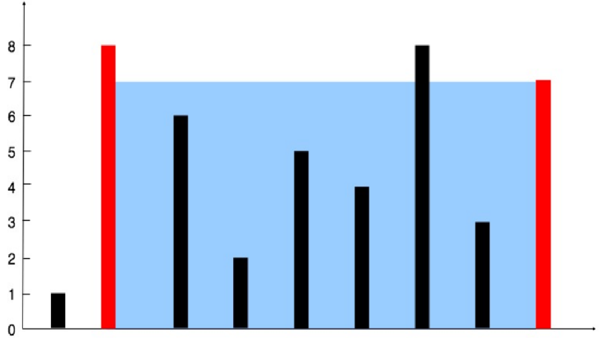

# 11.Container With Most Water
## 题⽬
Given n non-negative integers a1, a2, ..., an , where each represents a point at coordinate (i, ai). n
vertical lines are drawn such that the two endpoints of line i is at (i, ai) and (i, 0). Find two lines,
which together with x-axis forms a container, such that the container contains the most water.
Note: You may not slant the container and n is at least 2.

The above vertical lines are represented by array [1,8,6,2,5,4,8,3,7]. In this case, the max area of
water (blue section) the container can contain is 49.
### Example 1:
```
Input: [1,8,6,2,5,4,8,3,7]
Output: 49
```
## 题⽬⼤意
给出⼀个⾮负整数数组 a1，a2，a3，…… an，每个整数标识⼀个竖⽴在坐标轴 x 位置的⼀堵⾼度为 ai
的墙，选择两堵墙，和 x 轴构成的容器可以容纳最多的⽔。
## 解题思路
这⼀题也是对撞指针的思路。⾸尾分别 2 个指针，每次移动以后都分别判断⻓宽的乘积是否最⼤。
### 注意
线之间形成的区域总是受限于短线的高度。此外，线越远，所获得的区域就越多。 我们使用两个指针，一个在开头，一个在数组末尾，构成行长度。此外，我们还保留了一个变量max来存储到目前为止获得的最大面积。在每步中，我们找到它们之间形成的区域，更新max并将指针指向另一端的指针。因为木桶原理，容积取决于行长度和最短高度的积，所以，两个端点高度较低的需要移动，因为高度较高的移动不可能大于原来的两端点积。这样，每次都是高度低的移动，直到两指针相邻
