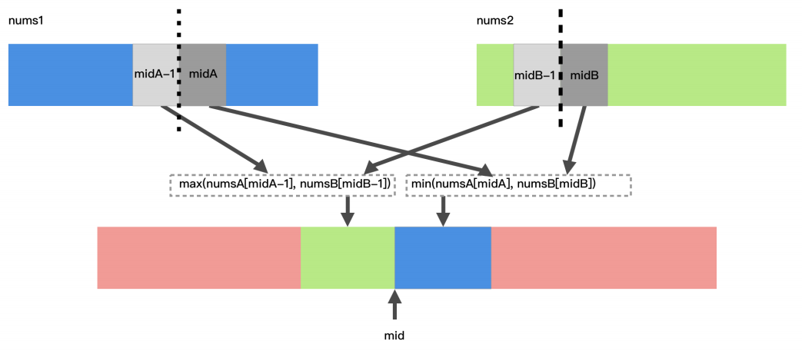

# Median of Two Sorted Arrays
## 题目
There are two sorted arrays nums1 and nums2 of size m and n respectively.
Find the median of the two sorted arrays. The overall run time complexity should be O(log (m+n)).
You may assume nums1 and nums2 cannot be both empty.
### Example 1:
```
nums1 = [1, 3]
nums2 = [2]
The median is 2.0
```
### Example 2:
```
nums1 = [1, 2]
nums2 = [3, 4]
The median is (2 + 3)/2 = 2.5
```
## 题目大意
给定两个⼤⼩为 m 和 n 的有序数组 nums1 和 nums2。
请你找出这两个有序数组的中位数，并且要求算法的时间复杂度为 O(log(m + n))。
你可以假设 nums1 和 nums2 不会同时为空。
## 解题思路
* 给出两个有序数组，要求找出这两个数组合并以后的有序数组中的中位数。要求时间复杂度为
```O(log (m+n))```。
* 这⼀题最容易想到的办法是把两个数组合并，然后取出中位数。但是合并有序数组的操作是
O(max(n,m)) 的，不符合题意。看到题⽬给的 log 的时间复杂度，很容易联想到⼆分搜索。
* 由于要找到最终合并以后数组的中位数，两个数组的总⼤⼩也知道，所以中间这个位置也是知道
的。只需要⼆分搜索⼀个数组中切分的位置，另⼀个数组中切分的位置也能得到。为了使得时间复
杂度最⼩，所以⼆分搜索两个数组中⻓度较⼩的那个数组。
* 关键的问题是如何切分数组 1 和数组 2 。其实就是如何切分数组 1 。先随便⼆分产⽣⼀个
midA ，切分的线何时算满⾜了中位数的条件呢？即，线左边的数都⼩于右边的数，即，
```nums1[midA-1] ≤ nums2[midB] && nums2[midB-1] ≤ nums1[midA]``` 。如果这些条件都不满
⾜，切分线就需要调整。如果 ```nums1[midA] < nums2[midB-1]``` ，说明 midA 这条线划分出来左
边的数⼩了，切分线应该右移；如果 ```nums1[midA-1] > nums2[midB]``` ，说明 midA 这条线划分
出来左边的数⼤了，切分线应该左移。经过多次调整以后，切分线总能找到满⾜条件的解。
* 假设现在找到了切分的两条线了， 数组 1 在切分线两边的下标分别是 ```midA - 1``` 和 ```midA``` 。 数 组 2 在切分线两边的下标分别是 midB - 1 和 midB 。最终合并成最终数组，如果数组⻓度是奇
数，那么中位数就是 ```max(nums1[midA-1]```, ```nums2[midB-1])``` 。如果数组⻓度是偶数，那么中间
位置的两个数依次是： ```max(nums1[midA-1]```, ```nums2[midB-1])``` 和 ```min(nums1[midA]```,
```nums2[midB])``` ，那么中位数就是 ```(max(nums1[midA-1], nums2[midB-1]) + min(nums1[midA], nums2[midB])) / 2``` 。图示⻅下图：
 

### 本题代码解析
这道题让我们求两个有序数组的中位数，而且限制了时间复杂度为 O(log (m+n))，看到这个时间复杂度，自然而然的想到了应该使用二分查找法来求解。但是这道题被定义为 Hard 也是有其原因的，难就难在要在两个未合并的有序数组之间使用二分法，如果这道题只有一个有序数组，让求中位数的话，估计就是个 Easy 题。对于这道题来说，可以将两个有序数组混合起来成为一个有序数组再做吗，这个时间复杂度限制说明这样做不行。还是要用二分法，而且是在两个数组之间使用，就不容易了。回顾一下中位数的定义，如果某个有序数组长度是奇数，那么其中位数就是最中间那个，如果是偶数，那么就是最中间两个数字的平均值。这里对于两个有序数组也是一样的，假设两个有序数组的长度分别为```m```和```n```，由于两个数组长度之和 ```m+n``` 的奇偶不确定，因此需要分情况来讨论，对于奇数的情况，直接找到最中间的数即可，偶数的话需要求最中间两个数的平均值。为了简化代码，不分情况讨论，使用一个小 trick，分别找第 ```(m+n+1) / 2``` 个，和 ```(m+n+2) / 2``` 个，然后求其平均值即可，这对奇偶数均适用。若 m+n 为奇数的话，那么其实 ```(m+n+1) / 2``` 和 ```(m+n+2) / 2``` 的值相等，相当于两个相同的数字相加再除以2，还是其本身。

好，这里需要定义一个函数来在两个有序数组中找到第```k```个元素，下面重点来看如何实现找到第```k```个元素。首先，为了避免拷贝产生新的数组从而增加时间复杂度，使用两个变量i和j分别来标记数组 ```nums1``` 和 ```nums2``` 的起始位置。然后来处理一些 corner cases，比如当某一个数组的起始位置大于等于其数组长度时，说明其所有数字均已经被淘汰了，相当于一个空数组了，那么实际上就变成了在另一个数组中找数字，直接就可以找出来了。还有就是如果 ```k=1``` 的话，只要比较 ```nums1``` 和 ```nums2``` 的起始位置```i```和```j```上的数字就可以了。难点就在于一般的情况怎么处理？因为需要在两个有序数组中找到第```k```个元素，为了加快搜索的速度，可以使用二分法，那么对谁二分呢，数组么？其实要对```k```二分，意思是需要分别在 ```nums1``` 和 ```nums2``` 中查找第 ```k/2``` 个元素，注意这里由于两个数组的长度不定，所以有可能某个数组没有第 ```k/2``` 个数字，所以需要先 check 一下，数组中到底存不存在第 ```k/2``` 个数字，如果存在就取出来，否则就赋值上一个整型最大值（目的是要在 ```nums1``` 或者 ```nums2``` 中先淘汰 ```k/2``` 个较小的数字，判断的依据就是看 ```midVal1``` 和 ```midVal2``` 谁更小，但如果某个数组的个数都不到 ```k/2``` 个，自然无法淘汰，所以将其对应的 ```midVal``` 值设为整型最大值，以保证其不会被淘汰），若某个数组没有第 ```k/2``` 个数字，则淘汰另一个数组的前 ```k/2``` 个数字即可。举个例子来说吧，比如 ```nums1 = {3}```，```nums2 = {2, 4, 5, 6, 7}```，```k=4```，要找两个数组混合中第4个数字，则分别在 ```nums1``` 和 ```nums2``` 中找第2个数字，而 ```nums1``` 中只有一个数字，不存在第二个数字，则 ```nums2``` 中的前2个数字可以直接跳过，为啥呢，因为要求的是整个混合数组的第4个数字，不管 ```nums1``` 中的那个数字是大是小，第4个数字绝不会出现在 ```nums2``` 的前两个数字中，所以可以直接跳过。

有没有可能两个数组都不存在第 ```k/2``` 个数字呢，这道题里是不可能的，因为K不是任意给的，而是给的 ```m+n``` 的中间值，所以必定至少会有一个数组是存在第 ```k/2``` 个数字的。最后就是二分法的核心啦，比较这两个数组的第 ```k/2``` 小的数字 ```midVal1``` 和 ```midVal2``` 的大小，如果第一个数组的第 ```k/2``` 个数字小的话，那么说明要找的数字肯定不在 ```nums1``` 中的前 ```k/2``` 个数字，可以将其淘汰，将 ```nums1``` 的起始位置向后移动 ```k/2``` 个，并且此时的K也自减去 ```k/2```，调用递归，举个例子来说吧，比如 ```nums1 = {1, 3}```，```nums2 = {2, 4, 5}```，```k=4```，要找两个数组混合中第4个数字，那么分别在 ```nums1``` 和 ```nums2``` 中找第2个数字，```nums1``` 中的第2个数字是3，```nums2``` 中的第2个数字是4，由于3小于4，所以混合数组中第4个数字肯定在 ```nums2``` 中，可以将 ```nums1``` 的起始位置向后移动 ```k/2``` 个。反之，淘汰 ```nums2``` 中的前 ```k/2``` 个数字，并将 ```nums2``` 的起始位置向后移动 ```k/2``` 个，并且此时的K也自减去 ```k/2```，调用递归即可，参见代码如下：